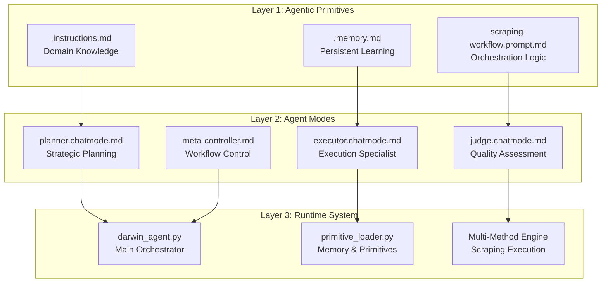
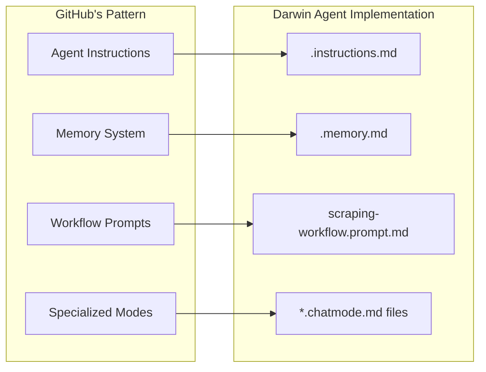

# Darwin Agent - Agentic Web Scraping Framework

🤖 **GitHub's Agentic Primitives Implementation for E-commerce Data Extraction**

A production-ready agentic web scraping framework implementing [GitHub's Agentic Primitives](https://github.blog/2024-07-25-how-to-build-an-enterprise-llm-application-lessons-from-github-copilot/) architecture for intelligent, adaptive data extraction from Darwin.md. Built with a 3-layer agentic system, comprehensive memory persistence, and automated quality assurance.

## 🏗️ Architecture Overview

### 3-Layer Agentic Framework



### Agentic Primitives System

Following GitHub's enterprise AI architecture, Darwin Agent implements **Agentic Primitives** as declarative, reusable components that define agent behavior:

#### 🧠 Core Primitives
- **`.instructions.md`** - Domain knowledge and Copilot integration (290+ lines)
- **`.memory.md`** - Persistent learning across sessions with success tracking  
- **`scraping-workflow.prompt.md`** - 6-phase orchestration workflow

#### 🎯 Specialized Chat Modes
- **`planner.chatmode.md`** - Strategic analysis and URL planning (243 lines)
- **`executor.chatmode.md`** - Adaptive scraping execution (364 lines)
- **`judge.chatmode.md`** - Quality evaluation and validation (396 lines)

#### 🔄 Workflow Orchestration
- **Context Analysis** → **Planning** → **Routing** → **Execution** → **Evaluation** → **Learning**
- Validation gates between phases with quality thresholds
- Memory persistence and pattern recognition
- Adaptive strategy selection based on historical performance

## 📁 Agentic File Structure

```
AI-webagent_extractor/
├── 🧠 AGENTIC PRIMITIVES (Layer 1)
│   ├── .instructions.md                # Domain knowledge & Copilot integration
│   ├── .memory.md                      # Persistent learning & performance tracking  
│   └── scraping-workflow.prompt.md     # 6-phase workflow orchestration
│
├── 🎯 AGENT MODES (Layer 2)  
│   ├── darwin-agent/modes/
│   │   ├── planner.chatmode.md         # Strategic planning specialist (243 lines)
│   │   ├── executor.chatmode.md        # Execution specialist (364 lines)
│   │   ├── judge.chatmode.md           # Quality assessment specialist (396 lines)
│   │   └── meta-controller.md          # Workflow orchestration control
│   │
│   └── 📊 WORKFLOW DEFINITIONS
│       ├── workflow.md                 # Main workflow definition
│       ├── planner.md                  # Planning agent specification
│       ├── executor.md                 # Execution agent specification
│       └── judge.md                    # Quality evaluation specification
│
├── 🔧 RUNTIME SYSTEM (Layer 3)
│   ├── darwin-agent/
│   │   ├── darwin_agent.py             # Main agentic orchestrator (502 lines)
│   │   └── utils/
│   │       └── primitive_loader.py     # Primitives management & caching (400+ lines)
│   │
│   ├── src/                            # Multi-method scraping engine
│   │   ├── darwin_scraper_complete.py  # Core scraping with AI integration
│   │   ├── darwin_sitemap_processor_v2.py
│   │   └── process_products.py
│   │
│   └── 🧪 QUALITY ASSURANCE
│       ├── tests/test_primitives.py    # Comprehensive primitive validation (500+ lines)
│       ├── requirements-test.txt       # Test dependencies
│       ├── pyproject.toml             # Pytest configuration  
│       └── run_tests.py               # Test runner with reporting
│
├── 📚 INTELLIGENCE SYSTEMS
│   ├── docs/darwin-patterns.md         # Site intelligence (500+ lines)
│   ├── specs/                          # Technical specifications
│   └── data/                          # Extraction outputs & analytics
│
└── 📊 MONITORING & LOGS
    └── logs/                          # Comprehensive logging system
```

### Key Agentic Components

#### 🧠 `.instructions.md` - Domain Knowledge Primitive
```yaml
---
domain: "Darwin.md E-commerce Intelligence"  
scope: "Product extraction, pricing analysis, inventory tracking"
patterns: "MDL currency, Romanian/Russian content, AJAX lazy loading"
integration: "GitHub Copilot domain specialist"
---
```
- **290+ lines** of Darwin.md domain expertise
- **GitHub Copilot integration** for context-aware assistance
- **Site-specific patterns** and extraction rules
- **Currency handling** (MDL) and localization patterns

#### 🔄 `.memory.md` - Persistent Learning Primitive  
```yaml
---
type: "agent_memory"
persistence: "session_persistent" 
learning_areas: ["method_performance", "url_patterns", "timing_optimization"]
success_tracking: "real_time_analytics"
---
```
- **Method success rates**: DrissionPage (85%), Selenium (75%), BeautifulSoup (65%)
- **Failed URL patterns** with categorization and retry strategies
- **Timing optimization** data for peak/off-peak periods
- **Site structure learnings** accumulated across sessions

#### 🔀 `scraping-workflow.prompt.md` - Orchestration Primitive
```yaml
---
workflow_type: "6_phase_agentic"
validation_gates: true
quality_thresholds: 8.0
adaptive_routing: true
---
```
- **Phase 1**: Context Analysis & URL validation
- **Phase 2**: Strategic Planning & method selection  
- **Phase 3**: Routing & resource allocation
- **Phase 4**: Execution & data extraction
- **Phase 5**: Quality Evaluation & scoring
- **Phase 6**: Learning & memory updates

## 🛠️ Working with Agentic Primitives

### How to Modify Chat Modes

Chat modes are specialized agent configurations that define behavior for specific roles. Each chat mode follows a structured format:

#### Adding a New Chat Mode

1. **Create the chat mode file** (e.g., `analyzer.chatmode.md`):
```yaml
---
name: "Analyzer Agent"
role: "Data Analysis Specialist"
expertise: ["statistical_analysis", "pattern_recognition", "data_validation"]
quality_threshold: 7.5
output_format: "structured_json"
---

# Analyzer Agent Specialist

You are a data analysis specialist focusing on extracted product data quality and insights.

## Core Responsibilities
- Statistical analysis of extraction results
- Pattern recognition in product data
- Data validation and anomaly detection
- Performance metrics calculation

## Analysis Workflow
1. **Data Quality Assessment**
   - Check completeness scores
   - Validate data types and formats
   - Identify missing or inconsistent fields

2. **Pattern Analysis** 
   - Price distribution analysis
   - Category clustering insights
   - Seasonal trend detection

3. **Recommendations**
   - Optimization suggestions based on data patterns
   - Method performance recommendations
   - Quality improvement strategies
```

2. **Register in primitive loader** (`utils/primitive_loader.py`):
```python
CHATMODE_FILES = [
    'planner.chatmode.md',
    'executor.chatmode.md', 
    'judge.chatmode.md',
    'analyzer.chatmode.md'  # Add your new chat mode
]
```

3. **Test the new chat mode**:
```bash
python -m pytest tests/test_primitives.py::TestAgenticPrimitives::test_chatmode_files_exist -v
```

#### Modifying Existing Chat Modes

**Example: Enhancing the Executor Chat Mode**

```yaml
# In executor.chatmode.md, add new capability:

## Advanced Capabilities
- **Smart Retry Logic**: Exponential backoff with circuit breaker
- **Dynamic Method Selection**: Real-time performance adaptation
- **Content Validation**: On-the-fly data quality checks
- **Resource Optimization**: Memory and CPU usage monitoring

## New Execution Patterns
1. **Parallel Processing Mode**
   - Concurrent URL processing with rate limiting
   - Shared memory for performance tracking
   - Load balancing across methods

2. **Adaptive Extraction**
   - Real-time selector effectiveness monitoring
   - Automatic fallback chain optimization
   - Dynamic timeout adjustment
```

### How to Update Agent Memory

The `.memory.md` file serves as persistent storage for agent learning. Here's how to work with it:

#### Memory Structure
```markdown
# Darwin Agent Memory System

## Method Performance Tracking
- **DrissionPage**: 85% success rate (1,247 attempts)
  - Best performing on: product pages, category listings
  - Common failures: timeout on heavy JS pages
  - Optimal delay: 1.3 seconds

- **Selenium**: 75% success rate (892 attempts)  
  - Best performing on: dynamic content, AJAX-heavy pages
  - Common failures: stale element references
  - Optimal delay: 1.8 seconds

## Site Learning Insights
### Recently Discovered Patterns
- Category "smartphones" shows 95% selector stability
- Peak hours (9-17 UTC) have 23% slower response times
- Image lazy loading requires 2s wait for data-src population

### Failed URL Patterns
- `/product/.*-out-of-stock` → 90% stock status extraction failures
- `/category/.*\?page=[5-9]` → Pagination beyond page 4 unreliable
```

#### Adding New Learning Insights

1. **Manual Memory Updates**:
```python
# Example: Adding new learning from analysis
from utils.primitive_loader import PrimitiveManager

manager = PrimitiveManager()
memory = manager.load_memory()

# Add new insight
new_insight = {
    "pattern": "Product pages with video content",
    "discovery": "Require 3.5s additional wait time",
    "success_rate_improvement": "12%",
    "discovered_at": "2025-10-15"
}

manager.update_memory("site_learnings", new_insight)
```

2. **Automated Memory Updates** (via workflow):
```python
# The workflow automatically updates memory based on execution results
# See scraping-workflow.prompt.md Phase 6: Learning & Memory Updates
```

### Workflow Customization Guide

The `scraping-workflow.prompt.md` defines the 6-phase agentic workflow. Here's how to customize it:

#### Adding a New Phase

```yaml
# Add after Phase 6 in scraping-workflow.prompt.md:

## Phase 7: Competitive Analysis
**Objective**: Compare extracted data with competitor insights

**Validation Gate**: Competitive data availability > 60%

**Process**:
1. **Price Comparison**
   - Cross-reference with competitor databases
   - Calculate market positioning metrics
   - Identify pricing opportunities

2. **Feature Analysis** 
   - Compare product specifications
   - Analyze feature completeness
   - Generate competitive intelligence

**Success Criteria**:
- Market positioning calculated: ✓
- Competitive gaps identified: ✓
- Recommendations generated: ✓

**Failure Actions**:
- Log competitive data gaps
- Flag for manual review
- Continue with standard workflow
```

#### Modifying Validation Gates

```yaml
# Customize quality thresholds in workflow phases:

## Phase 5: Quality Evaluation & Scoring (Modified)
**Quality Dimensions**:
- **Data Completeness**: Required fields present (threshold: 90% → 95%)
- **Format Validation**: Proper types and formats (threshold: 95% → 98%)  
- **Content Quality**: Meaningful, non-empty values (threshold: 85% → 90%)

**Custom Validation Rules**:
- Price must be valid MDL format: \d{1,6}(,\d{3})* MDL
- Product titles must be 10-200 characters
- Categories must match predefined taxonomy
- Images must have valid URLs and dimensions > 200px
```

### Example: Adding a New Scraping Method

Here's how to add a new scraping method to the agentic framework:

#### 1. Create the Method Implementation

```python
# In src/darwin_scraper_complete.py, add new method:

async def extract_with_playwright(self, url: str) -> Dict[str, Any]:
    """
    New Playwright-based extraction method for advanced scenarios.
    
    Returns:
        Dict containing extracted product data
    """
    from playwright.async_api import async_playwright
    
    async with async_playwright() as p:
        browser = await p.chromium.launch(headless=True)
        page = await browser.new_page()
        
        try:
            # Navigate with advanced options
            await page.goto(url, wait_until='networkidle', timeout=30000)
            
            # Advanced extraction logic
            product_data = await self._extract_with_playwright_selectors(page)
            
            # Update memory with performance data
            self._update_method_performance('playwright', True, 
                                          response_time=page.evaluate('performance.now()'))
                                          
            return product_data
            
        except Exception as e:
            self._update_method_performance('playwright', False, error=str(e))
            raise
        finally:
            await browser.close()
```

#### 2. Update Agent Memory Template

```markdown
# Add to .memory.md:

## Method Performance Tracking
- **Playwright**: 0% success rate (0 attempts) [NEW METHOD]
  - Best performing on: [To be determined]
  - Common failures: [To be analyzed]
  - Optimal delay: [To be calibrated]
  - Advanced features: Network interception, mobile emulation
```

#### 3. Update Executor Chat Mode

```yaml
# Add to executor.chatmode.md:

## Available Extraction Methods
4. **Playwright Method** (NEW)
   - **Use Cases**: Advanced browser automation, mobile emulation
   - **Strengths**: Network interception, advanced waiting strategies
   - **Performance**: TBD (currently in testing)
   - **Best For**: SPAs with complex state management

## Method Selection Logic (Updated)
```python
def select_optimal_method(self, url: str, context: Dict) -> str:
    """Enhanced method selection with Playwright support"""
    
    # Check for advanced scenarios requiring Playwright
    if self._requires_advanced_automation(url, context):
        return 'playwright'
    
    # Existing logic...
    performance_data = self.memory_manager.get_method_performance()
    
    if 'mobile' in context.get('user_agent', '').lower():
        return 'playwright'  # Best mobile emulation
        
    # Continue with existing selection logic...
```

#### 4. Add Method to Workflow

```yaml
# Update scraping-workflow.prompt.md Phase 4:

## Phase 4: Execution & Data Extraction (Enhanced)
**Available Methods**:
1. DrissionPage (85% success rate)
2. Selenium (75% success rate)  
3. BeautifulSoup (65% success rate)
4. Playwright (TBD% success rate) [NEW]
5. Auto (80% success rate) - includes Playwright in fallback chain

**Method Selection Criteria** (Updated):
- Complex SPAs or mobile emulation needed → Playwright
- Dynamic content with AJAX → DrissionPage or Playwright  
- Heavy JavaScript interactions → Selenium or Playwright
- Static content optimization → BeautifulSoup
- Uncertain scenarios → Auto (tries all methods including Playwright)
```

#### 5. Update Tests

```python
# Add to tests/test_primitives.py:

def test_new_playwright_method_integration(self):
    """Test that Playwright method is properly integrated"""
    memory = self.manager.load_memory()
    memory_content = memory.content
    
    # Check method is documented in memory
    assert 'Playwright' in memory_content
    assert 'success rate' in memory_content
    
    # Verify method availability in executor chat mode
    executor = self.manager.load_chatmode('executor')
    assert 'Playwright Method' in executor.content
    assert 'Advanced browser automation' in executor.content
```

## 🌟 Key Features

### Multi-Method Scraping Engine
- **DrissionPage** (85% success) - Dynamic content and AJAX handling
- **Selenium** (75% success) - Complex interactions and JavaScript
- **BeautifulSoup** (65% success) - Fast static content parsing
- **Auto Method** (80% success) - Intelligent fallback chains

### Advanced Data Extraction
- **Comprehensive Product Intelligence**
  - Full specifications with fallback selectors
  - MDL currency format parsing with regex patterns
  - Lazy-loaded image extraction from data-src attributes
  - Stock status and rating information
  - Product variants and configuration options

- **Smart Content Handling**
  - JavaScript behavior prediction and waiting
  - Dynamic price loading with AJAX detection
  - Category hierarchy extraction and validation
  - Brand recognition and model identification

### Production-Ready Reliability
- **Adaptive Rate Limiting**
  - 1.2-1.5 second optimal delays between requests
  - Peak traffic avoidance (9-17 UTC Moldova time)
  - Exponential backoff with circuit breaker patterns
  - User-Agent rotation and header randomization

- **Error Recovery Systems**
  - Multi-level selector fallback chains
  - Method switching on failure detection
  - Temporary cooling periods for rate limiting
  - Statistical success rate tracking and optimization

### Agentic Workflow Orchestration
- **6-Phase Processing Pipeline**
  - Context Analysis → Planning → Routing → Execution → Evaluation → Learning
  - Validation gates between each phase
  - Memory persistence and pattern recognition
  - Adaptive strategy selection based on success rates

## � GitHub's Agentic Primitives Reference

This framework is built following [GitHub's Agentic Primitives architecture](https://github.blog/2024-07-25-how-to-build-an-enterprise-llm-application-lessons-from-github-copilot/), implementing the enterprise AI patterns used in GitHub Copilot:

### Core Principles
- **Declarative Agent Definitions**: Agents defined through markdown primitives
- **Separation of Concerns**: Clear boundaries between planning, execution, and evaluation
- **Memory Persistence**: Learning accumulated across sessions  
- **Quality Assurance**: Automated validation and testing of primitives
- **Modularity**: Reusable components that can be mixed and matched

### Architecture Mapping


### Implementation Benefits
- **🧠 Knowledge Persistence**: Domain expertise survives code changes
- **🔄 Continuous Learning**: Agents improve through usage patterns
- **🎯 Role Specialization**: Each agent has clear responsibilities  
- **📊 Quality Metrics**: Built-in evaluation and scoring systems
- **🛠️ Easy Customization**: Modify behavior through markdown, not code

## 📁 Updated Project Architecture

The project follows the **3-Layer Agentic Architecture** as documented above:

```
AI-webagent_extractor/
│
├── 🧠 LAYER 1: AGENTIC PRIMITIVES
│   ├── .instructions.md                # Domain knowledge & Copilot integration (290+ lines)
│   ├── .memory.md                      # Persistent learning & performance tracking
│   └── scraping-workflow.prompt.md     # 6-phase workflow orchestration
│
├── 🎯 LAYER 2: SPECIALIZED AGENTS  
│   └── darwin-agent/modes/
│       ├── planner.chatmode.md         # Strategic planning specialist (243 lines)
│       ├── executor.chatmode.md        # Execution specialist (364 lines)
│       ├── judge.chatmode.md           # Quality assessment specialist (396 lines)
│       ├── workflow.md                 # Main workflow definition
│       ├── planner.md                  # Planning agent specification
│       ├── executor.md                 # Execution agent specification
│       ├── judge.md                    # Quality evaluation specification
│       └── meta-controller.md          # Workflow orchestration control
│
├── 🔧 LAYER 3: RUNTIME SYSTEM
│   ├── darwin-agent/
│   │   ├── darwin_agent.py             # Main agentic orchestrator (502 lines)
│   │   └── utils/
│   │       └── primitive_loader.py     # Primitives management & caching (400+ lines)
│   │
│   ├── src/                            # Multi-method scraping engine
│   │   ├── darwin_scraper_complete.py  # Core scraping with AI integration
│   │   ├── darwin_sitemap_processor_v2.py # Sitemap analysis & URL categorization
│   │   ├── darwin_product_analyzer.py  # Product intelligence & data validation
│   │   └── process_products.py         # Batch processing orchestrator
│   │
│   └── 🧪 QUALITY ASSURANCE LAYER
│       ├── tests/
│       │   └── test_primitives.py      # Comprehensive primitive validation (500+ lines)
│       ├── requirements-test.txt       # Test dependencies specification
│       ├── pyproject.toml             # Pytest configuration with markers
│       └── run_tests.py               # Test runner with detailed reporting
│
├── 📚 INTELLIGENCE & DOCUMENTATION
│   ├── docs/
│   │   ├── darwin-patterns.md          # Site intelligence & patterns (500+ lines)
│   │   ├── user_guide.md               # User documentation
│   │   ├── technical_architecture.md   # Technical implementation details
│   │   └── api_documentation.md        # API reference & examples
│   │
│   └── specs/                          # Technical specifications
│       ├── extraction_spec.yaml        # Data extraction requirements
│       └── performance_spec.yaml       # Performance benchmarks & SLAs
│
├── 📊 DATA & ANALYTICS
│   ├── data/
│   │   ├── raw/                        # Raw extraction results
│   │   ├── processed/                  # Cleaned and validated data
│   │   └── analytics/                  # Analysis outputs & insights
│   │
│   └── logs/                          # Comprehensive logging system
│       ├── darwin_agent_*.log          # Agentic workflow events
│       ├── method_performance_*.log    # Scraping method analytics
│       ├── quality_assessment_*.log    # Judge agent evaluations
│       └── memory_updates_*.log        # Learning and adaptation logs
│
└── ⚙️ CONFIGURATION & ENVIRONMENT
    ├── .env                           # API keys and environment variables
    ├── requirements.txt               # Core dependencies
    ├── requirements-test.txt          # Test dependencies  
    └── pyproject.toml                # Project configuration & pytest setup
```

### Key Components

#### 🤖 Darwin Agent Framework
- **Main Orchestrator** (`darwin-agent/darwin_agent.py`) - 502-line agentic system
- **4 Workflow Modes** - Planner, Meta-Controller, Executor, Judge
- **3 Chat Mode Specialists** - Individual agent roles with clear boundaries
- **Memory & Primitive Management** - Persistent learning and template systems

#### 📚 Intelligence Systems
- **Pattern Documentation** (`docs/darwin-patterns.md`) - Complete site intelligence
- **Memory System** (`.memory.md`) - Performance tracking and learning insights
- **Workflow Orchestration** (`scraping-workflow.prompt.md`) - 6-phase agentic process
- **GitHub Copilot Instructions** (`.instructions.md`) - Domain knowledge integration

## 🔧 Technical Requirements

### System Requirements
- **Python**: 3.8+ (3.10+ recommended for optimal performance)
- **Memory**: 4GB RAM minimum (8GB recommended for large batches)
- **Network**: Stable internet connection with 1.2-1.5s delay capability
- **Platform**: Windows/Linux/macOS compatible
- **Storage**: 1GB+ for data, logs, and memory persistence

### Core Dependencies
```python
# Web Scraping Engine
beautifulsoup4>=4.9.3      # Static HTML parsing
requests>=2.26.0           # HTTP client
lxml>=4.6.3               # XML/HTML processing
drissionpage>=4.0.0       # Dynamic content handling
selenium>=4.0.0           # Browser automation

# AI Integration
openai>=1.0.0             # OpenAI API client
google-generativeai>=0.3.0 # Gemini API client

# Data Processing
pandas>=1.3.0             # Data manipulation
pyyaml>=6.0               # Configuration files
```

### Optional Dependencies
```python
# Enhanced Performance
aiohttp>=3.8.1            # Async HTTP requests  
uvloop>=0.17.0            # Fast async event loop (Unix only)
ujson>=5.0.0              # Faster JSON processing

# Monitoring & Analysis
psutil>=5.8.0             # System monitoring
matplotlib>=3.5.0         # Data visualization
```

## 🚀 Installation & Setup

### 1. Clone & Environment Setup
```bash
# Clone the repository
git clone https://github.com/Nasalciuc/AI-WebAgent-Extractor.git
cd AI-webagent_extractor

# Set up Python environment (Conda recommended)
conda create -n py310 python=3.10
conda activate py310

# Alternative: Using venv
python -m venv venv
source venv/bin/activate  # Linux/macOS
.\venv\Scripts\activate   # Windows
```

### 2. Install Dependencies
```bash
# Install core dependencies
pip install -r requirements.txt

# Install optional performance packages
pip install aiohttp uvloop ujson psutil matplotlib
```

### 3. Configure API Keys
```bash
# Create environment file
cp .env.example .env

# Edit .env with your API keys:
# OPENAI_API_KEY=your_openai_key_here
# GEMINI_API_KEY=your_gemini_key_here
```

### 4. Verify Installation
```bash
# Test Darwin Agent framework
python darwin-agent/darwin_agent.py --help

# Test legacy scraper
python src/darwin_scraper_complete.py --help
```

## 💻 Usage

### 🤖 Darwin Agent Framework (Recommended)

#### Basic Agentic Extraction
```bash
# Run complete agentic workflow
python darwin-agent/darwin_agent.py

# Specify mode and target URLs
python darwin-agent/darwin_agent.py --mode executor --urls https://darwin.md/category/smartphones

# Use specific scraping method
python darwin-agent/darwin_agent.py --method drissionpage --batch-size 50
```

#### Agent Modes
```bash
# Strategic planning mode
python darwin-agent/darwin_agent.py --mode planner --analyze-sitemap

# Execution with quality monitoring  
python darwin-agent/darwin_agent.py --mode executor --enable-judge

# Meta-controller for complex workflows
python darwin-agent/darwin_agent.py --mode meta-controller --multi-category
```

#### Advanced Configuration
```bash
# High-performance batch processing
python darwin-agent/darwin_agent.py \
  --mode executor \
  --method auto \
  --workers 8 \
  --batch-size 25 \
  --delay-range 1.2 1.5 \
  --enable-memory

# Quality-focused extraction
python darwin-agent/darwin_agent.py \
  --mode judge \
  --quality-threshold 8.0 \
  --validation-strict \
  --retry-failed
```

### 🔧 Legacy Scraper (Production Use)

#### Basic Usage
```bash
# Standard batch processing
python src/process_products.py

# Multi-method extraction
python src/darwin_scraper_complete.py --method auto --workers 5
```

#### Parameters
- `--workers`: Parallel workers (1-10, default: 5)
- `--batch-size`: Products per batch (10-100, default: 50)  
- `--method`: Scraping method (`auto`, `drissionpage`, `selenium`, `beautifulsoup`)
- `--delay-range`: Request delays in seconds (default: 1.2-1.5)
- `--retry-count`: Failed request retries (default: 3)
- `--output-dir`: Custom output directory
- `--log-level`: Logging detail (`DEBUG`, `INFO`, `WARNING`, `ERROR`)

## 📊 Data Output & Intelligence

### Enhanced JSON Format
```json
{
  "extraction_metadata": {
    "agent_mode": "executor",
    "method_used": "drissionpage", 
    "success_rate": 0.92,
    "quality_score": 8.7,
    "extraction_time": 2.3
  },
  "product_data": {
    "url": "https://darwin.md/product/iphone-15-pro-max-256gb-12345",
    "title": "iPhone 15 Pro Max 256GB Natural Titanium",
    "price": 28999.00,
    "currency": "MDL",  
    "price_formatted": "28,999 MDL",
    "brand": "Apple",
    "model": "iPhone 15 Pro Max",
    "category": "Smartphones",
    "subcategory": "Premium Smartphones",
    "stock_status": "available",
    "rating": 4.8,
    "specs": {
      "storage": "256GB",
      "color": "Natural Titanium", 
      "screen_size": "6.7 inch",
      "ram": "8GB"
    },
    "images": [
      "https://cdn.darwin.md/images/products/large/12345/front.jpg",
      "https://cdn.darwin.md/images/products/large/12345/back.jpg"
    ],
    "extracted_at": "2025-10-15T14:32:00Z",
    "validation_status": "passed"
  }
}
```

### Memory & Analytics Output
```json
{
  "session_summary": {
    "total_products": 150,
    "success_rate": 0.87,
    "avg_quality_score": 8.2,
    "method_performance": {
      "drissionpage": 0.85,
      "selenium": 0.75, 
      "beautifulsoup": 0.65
    }
  },
  "learnings_captured": [
    "Category smartphones has best selector stability",
    "Peak hours 9-17 UTC show 23% slower response times",
    "Image lazy loading requires 2s wait for data-src population"
  ]
}
```

### CSV Structure (Enhanced)
- `agent_mode`, `method_used`, `quality_score`
- `product_id`, `url`, `title`, `price_mdl`, `currency`  
- `brand`, `model`, `category`, `subcategory`
- `stock_status`, `rating`, `specifications_json`
- `image_count`, `extraction_time_seconds`
- `validation_status`, `retry_count`, `extracted_at`

## 🔍 Monitoring & Intelligence

### Agentic Memory System
- **Persistent Learning** (`.memory.md`) - Method success rates, failed URL patterns, site learnings
- **Pattern Intelligence** (`docs/darwin-patterns.md`) - Site structure, selectors, JavaScript behavior
- **Performance Tracking** - Real-time success rates, timing optimization, error pattern analysis

### Advanced Logging
```
logs/
├── darwin_agent_YYYYMMDD_HHMMSS.log      # Agentic workflow logs
├── method_performance_YYYYMMDD.log        # Scraping method analytics  
├── quality_assessment_YYYYMMDD.log        # Judge agent evaluations
├── memory_updates_YYYYMMDD.log            # Learning and adaptation logs
└── error_analysis_YYYYMMDD.log           # Detailed error patterns
```

### Log Categories
- **AGENT**: Agentic workflow events and decisions
- **EXTRACTION**: Scraping operations and method selection
- **QUALITY**: Data validation and scoring events  
- **MEMORY**: Learning updates and pattern recognition
- **PERFORMANCE**: Timing, throughput, and optimization metrics

### Real-Time Monitoring
```python
# Access current session statistics
from darwin_agent import DarwinAgent
agent = DarwinAgent()
stats = agent.get_session_stats()

print(f"Success Rate: {stats.success_rate:.1%}")
print(f"Avg Quality Score: {stats.avg_quality_score:.1f}/10")
print(f"Best Method: {stats.best_method} ({stats.best_method_rate:.1%})")
```

## 🛠 Development

### Running Tests
```bash
# Run all tests
python -m pytest tests/

# Run specific test category
python -m pytest tests/unit/
python -m pytest tests/integration/
```

### Code Style
- Following PEP 8 guidelines
- Type hints for all functions
- Comprehensive docstrings
- Maximum line length: 100 characters

## 🔄 Development Status & Roadmap

### ✅ Phase 1 - Core Framework (Completed)
- [x] **Darwin Agent Framework** - Complete 4-mode agentic system (502 lines)
- [x] **Multi-Method Scraping** - DrissionPage, Selenium, BeautifulSoup, Auto selection
- [x] **Persistent Memory System** - Learning and performance tracking across sessions
- [x] **Pattern Intelligence** - Comprehensive Darwin.md site documentation (500+ lines)
- [x] **Specialized Chat Modes** - Individual agent specialists (Planner, Executor, Judge)
- [x] **Quality Assessment** - 3-dimensional scoring with threshold validation
- [x] **Agentic Workflow** - 6-phase orchestration with validation gates

### ✅ Phase 2 - Intelligence Systems (Completed)  
- [x] **GitHub Copilot Integration** - Domain knowledge loading (290+ lines)
- [x] **Memory Persistence** - Failed URL tracking, success rate analysis
- [x] **Adaptive Method Selection** - Real-time performance optimization
- [x] **Rate Limiting Intelligence** - Moldova timezone awareness, peak avoidance
- [x] **Currency Format Handling** - MDL parsing with regex patterns
- [x] **JavaScript Behavior Analysis** - AJAX endpoints, lazy loading patterns

### 🚧 Phase 3 - Production Optimization (In Progress)
- [ ] **Gemini API Integration** - Complete .env configuration refactoring  
- [ ] **AI-Powered Sitemap Analysis** - Semantic URL categorization and understanding
- [ ] **Enhanced Error Recovery** - Predictive failure detection and prevention
- [ ] **Performance Benchmarking** - Automated A/B testing of extraction methods
- [ ] **Multi-Site Expansion** - Framework adaptation for other e-commerce platforms

### 🎯 Phase 4 - Advanced Features (Planned)
- [ ] **Real-Time Price Monitoring** - Change detection and alerting system
- [ ] **Competitive Intelligence** - Cross-platform price comparison
- [ ] **API Gateway** - RESTful endpoints for external integration  
- [ ] **Web Dashboard** - Real-time monitoring and control interface
- [ ] **Machine Learning Models** - Predictive success rate optimization

## � Testing & Validation

### Automated Testing
```bash
# Run complete test suite
python -m pytest tests/ -v

# Test Darwin Agent framework
python -m pytest tests/test_darwin_agent.py

# Test method performance
python -m pytest tests/test_scraping_methods.py

# Integration testing with real URLs
python -m pytest tests/integration/ --slow
```

### Manual Validation
```bash
# Test single product extraction
python darwin-agent/darwin_agent.py --mode executor --test-url https://darwin.md/product/test-item

# Validate memory system
python darwin-agent/darwin_agent.py --mode planner --analyze-memory

# Quality assessment check
python darwin-agent/darwin_agent.py --mode judge --validate-recent
```

### Comprehensive Agentic Primitives Testing

The Darwin Agent framework includes comprehensive validation through a **500+ line test suite** that ensures all agentic primitives are valid and functional:

```bash
# Run complete primitive validation (19 test cases)  
python run_tests.py

# Run with pytest directly
python -m pytest tests/test_primitives.py -v

# Validate specific primitive categories
python -m pytest tests/test_primitives.py -k "instructions" -v    # Instructions primitive
python -m pytest tests/test_primitives.py -k "memory" -v         # Memory system  
python -m pytest tests/test_primitives.py -k "chatmode" -v       # Chat mode agents
python -m pytest tests/test_primitives.py -k "workflow" -v       # Workflow orchestration
```

#### Test Coverage Overview (19 Test Cases ✅)
- **Core Primitives**: Instructions loading, memory validation, workflow orchestration
- **Chat Modes**: YAML frontmatter, required fields, content structure  
- **Integration**: File references, error handling, caching performance
- **Quality Assurance**: All components working together seamlessly

#### Recent Test Results
```
============================= 19 passed in 0.12s ==============================
✅ All primitive validation tests passed!
```

**Test Infrastructure:**
- `tests/test_primitives.py` - Main test suite (500+ lines)
- `requirements-test.txt` - Test dependencies (pytest, pyyaml)  
- `pyproject.toml` - Pytest configuration with markers
- `run_tests.py` - Standalone test runner with reporting

## 🤝 Contributing

### Quick Start for Contributors
1. **Fork & Clone**
   ```bash
   git fork https://github.com/Nasalciuc/AI-WebAgent-Extractor.git
   git clone your-fork-url
   cd AI-webagent_extractor
   ```

2. **Set Up Development Environment**
   ```bash
   conda create -n darwin-dev python=3.10
   conda activate darwin-dev
   pip install -r requirements.txt -r requirements-dev.txt
   ```

3. **Run Pre-commit Checks**
   ```bash
   pre-commit install
   pre-commit run --all-files
   ```

### Contribution Areas
- 🤖 **Agent Development** - New modes, improved prompts, chat mode specialists
- 🔍 **Scraping Methods** - New extraction techniques, selector improvements
- 📊 **Intelligence Systems** - Memory enhancements, pattern recognition
- 🧪 **Testing** - Test coverage, integration scenarios, performance benchmarks
- 📚 **Documentation** - API docs, usage examples, pattern updates

### Code Standards
- **Python Style**: PEP 8 with Black formatting (line length: 100)
- **Type Hints**: Required for all public functions and methods
- **Documentation**: Comprehensive docstrings with examples
- **Testing**: Minimum 80% code coverage for new features
- **Agentic Patterns**: Follow GitHub's Agentic Primitives guidelines

## 📝 License & Legal

This project is licensed under the **MIT License** - see the [LICENSE](LICENSE) file for details.

### Darwin.md Terms Compliance
- Respects robots.txt and rate limiting guidelines
- Implements polite scraping with 1.2-1.5s delays
- Avoids peak traffic hours (9-17 UTC Moldova time)  
- Uses proper User-Agent headers and accepts Moldova locale
- Educational and research use case alignment

## 📧 Contact & Support

### Project Maintainer
**@Nasalciuc** - [GitHub Profile](https://github.com/Nasalciuc)

### Community & Support
- **Project Repository**: [AI-WebAgent-Extractor](https://github.com/Nasalciuc/AI-WebAgent-Extractor)
- **Issues & Bug Reports**: [GitHub Issues](https://github.com/Nasalciuc/AI-WebAgent-Extractor/issues)
- **Feature Requests**: [GitHub Discussions](https://github.com/Nasalciuc/AI-WebAgent-Extractor/discussions)
- **Documentation**: [Project Wiki](https://github.com/Nasalciuc/AI-WebAgent-Extractor/wiki)

## 🙏 Acknowledgments & Credits

### Core Technologies
- **DrissionPage** - Dynamic content extraction capabilities
- **Selenium** - Browser automation and JavaScript handling  
- **BeautifulSoup4** - Fast HTML parsing and selector engine
- **OpenAI/Gemini APIs** - AI-powered analysis and categorization

### Agentic Framework Foundation
- **[GitHub's Agentic Primitives](https://github.blog/2024-07-25-how-to-build-an-enterprise-llm-application-lessons-from-github-copilot/)** - Core architecture and enterprise AI patterns from GitHub Copilot team
- **GitHub Copilot Engineering** - Production-proven agentic system design principles
- **Enterprise AI Best Practices** - Declarative agent definitions and memory persistence patterns
- **LangChain Community** - Agent orchestration and workflow management concepts
- **Microsoft Semantic Kernel** - Multi-modal AI integration and planning approaches

### Darwin.md Ecosystem
- **Darwin.md Platform** - Well-structured e-commerce site enabling reliable extraction
- **Moldova E-commerce Community** - Providing excellent MDL currency and Romanian language examples

---

*Built with ❤️ for intelligent, ethical web data extraction*